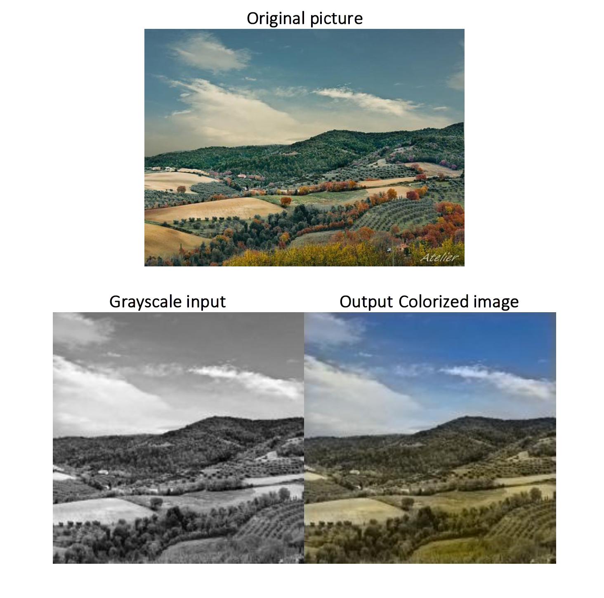

# Image-Colorization-ComputerVision

## REPORT ON IMAGE COLOURIZATION

Firstly, I used L*a*b color space instead of the RGB color space to train the models. I used this approach because in this case I just feed in the L channel as input and predict the 2 other channels a and b. I believe this possible 2 combinations will be much easier to predict rather than the 3 combinations of RGB.

Metrics used:

I used a simple convolutional neural network, where a set of convolutional layers are used to extract features from the image and then deconvolution is applied to upscale it.

I performed regression in this case, so I used mean square error loss function. Here I tried to minimize the square distance between the color value of the predicted one to the ground truth color value.

I believe in this case the images are not colored properly because of the multi-modality of the perform.

## How to improve the overall system?

Since the loss function doesn’t work well in the case of normal convolutional network, I researched more on the topic and read the following papers:

U-Net: Convolutional Networks for Biomedical Image Segmentation:
https://arxiv.org/abs/1505.04597

Image-to-Image translation with Conditional Adversarial Networks:
https://arxiv.org/abs/1611.07004

In this case I tried to implement 2 losses: one is the L1 loss, which is the regression task and the other one is the Adversarial GAN loss. The adversarial (GAN) loss helps to solve the problem in an unsupervised manner.
The generator here is implemented as Unet.

I implemented both the generator and discriminator model as per the papers above.

I implemented in such a way that the generator takes the grayscale as input and produces a new channel output. The discriminator takes I the new 3 channel output, concatenates with the grayscale image and tells if its fake or real. Due to time constraint, I’m facing issue with the channel configurations in the GAN code part. But it’s a solvable issue.

The condition that I provide here is that both the generator and discriminator will take in the grayscale image. The loss function is calculated as presented in the above-mentioned paper.

The code for GAN-Unet implementation is present inside the “Unet-Gan-Implementation” folder.

For maintaining the average mood or temperature, I think we can pretrain the generator for classification. This way the whole generator might be pretrained on the task of colorization with L1 task. We can use a pretrained ResNet18 as the backbone of the Unet.
